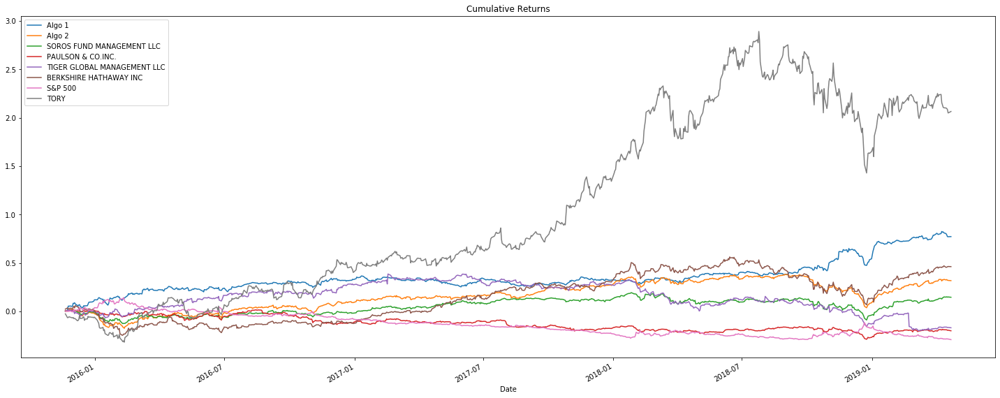

# Quantitative Analysis using Pandas

When looking at the trend in cumulative returns, both algorithm portfolios, Soros Fund Management, and Berkshire Hathaway perform better than the S&P 500. Paulson & CO follows a similiar downward trend in cumulative returns with the S&P 500. Tiger Global Management began with an upward trend but reversed to a downward trend.

With hindsight, my portfolio had the best trend for cumulative returns compared to the others for this time frame. But because my portfolio is not as diversifed as others, my portfolio also has the second largest spread on the boxplot and the largest standard deviation. My portfolio would have paid well for the risk an investor would have assumed. It has the second highest sharpe ratio with 1.17, only behind Algo 1 which has a sharpe ratio of 1.47 in the same time period. My portfolio also has a moderate positive correaltion with Algo 2, Soros Fund Management and Berkshire Hathaway.

